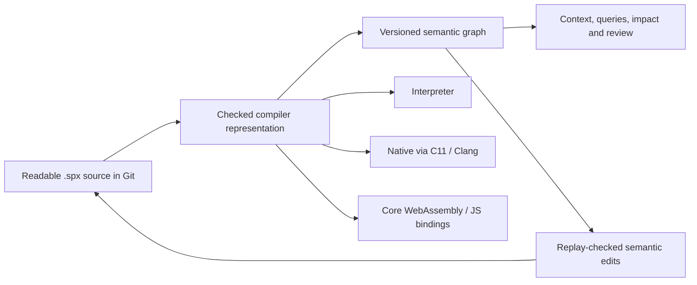

<div align="center">

# SEMAPRAX

### Meaning in. Verified machine code out.

**A systems programming language built for AI agents. Still readable by humans.**

Give coding agents a typed map of your program, not just a pile of files.
Build runtime agents whose proposals must pass checked code before they can act.

[](https://github.com/wavect/semaprax/actions/workflows/ci.yml)
[](Cargo.toml)
[](#project-status)
[](LICENSE)

[Get started](#get-started) · [Why Semaprax?](#why-semaprax) ·
[Build agents](#agents-as-programs-not-just-prompts) ·
[Handbook](https://wavect.github.io/semaprax/) · [Examples](examples/README.md) · [Spec library](docs/index.md)

</div>

https://github.com/user-attachments/assets/8768f221-86c3-40a8-ad62-e75ee74ee66c

> [!WARNING]
> Semaprax is **alpha research software**, not a production-ready language.
> Syntax, protocols, and binary interfaces can change. Use it to experiment,
> build prototypes, and help shape the language, not for production or
> safety-critical workloads.

## Why Semaprax?

**The idea: make meaning, constraints, and change first-class parts of programming.**

Semaprax keeps human-readable `.spx` source in Git. The compiler also exposes a
versioned semantic graph: declarations, types, contracts, effects, and their
relationships. A coding agent can ask what a function means, inspect its
callers, and propose a change against the exact revision it inspected.

| What you get | Why it matters |
| --- | --- |
| **Stable identities** | An explicit `@id("math.add")` identifies the same declaration after a supported display-name change. Tools need not treat its spelling as its identity. |
| **Relevant, bounded context** | Query a declaration and its semantic neighborhood with explicit depth, node, and byte limits instead of always transferring the whole graph. |
| **Contracts, effects, and ownership** | Express what code expects, what it promises, which effects it declares, and how it owns or borrows values. |
| **Checked changes** | Preview supported semantic edits, inspect their impact, and reject stale or invalid transactions rather than blindly overwrite source. |
| **Typed runtime agents** | Separate an AI model's proposal from deterministic authorization, effect execution, and state transitions. |

This is a language and toolchain, not a prompt wrapper, a natural-language
compiler, or a requirement to use AI. You can write and run ordinary programs
without an AI model or API key.

## Get started

### Run your first program

You need **Git and Rust/Cargo 1.88+** for this source-checkout route. The two
commands below use the checker and interpreter; they do not require Clang,
Node.js, or a model provider. Cargo may download Rust dependencies and compile
the toolchain on the first run.

```sh
git clone https://github.com/wavect/semaprax.git
cd semaprax

cargo run --locked -p semaprax -- check examples/meaning.spx
cargo run --locked -p semaprax -- run examples/meaning.spx
```

The first command reports a verified program and its revision. The second
prints **`42`**. No global installation or `PATH` change is needed.

### Use shorter commands and create a project

From the same repository directory, install the standalone CLI:

```sh
cargo install --locked --path . --bin semaprax
```

Ensure Cargo's binary directory is on `PATH`; in Bash or Zsh:

```sh
export PATH="$HOME/.cargo/bin:$PATH"
semaprax --version
```

Then create, check, test, and run a multi-file project without leaving the
repository directory:

```sh
semaprax new first-semaprax
semaprax check first-semaprax/semaprax.toml
semaprax test first-semaprax/semaprax.toml
semaprax run first-semaprax/semaprax.toml
```

The generated calculator prints **`42`**. It includes a manifest, source, tests,
and an `AGENTS.md` with project commands and language-specific guidance.
`new` requires a fresh destination; it does not initialize Git, install
packages, or access the network.

**All remaining commands assume the repository root.** To stay with the
no-install route, replace `semaprax` with `cargo run --locked -p semaprax --`.
Shell examples use POSIX syntax; [Install](handbook/getting-started/install.md) covers Windows,
prebuilt release archives, prerequisites, and troubleshooting. The
[full quickstart](handbook/getting-started/first-project.md) takes the generated project further.

## A small SEMAPRAX program

This is the complete [program you just ran](examples/meaning.spx):

```semaprax
module examples.meaning;

@id("math.add")
fn add(left: i64, right: i64) -> i64
    requires left >= 0
    requires right >= 0
    ensures result == left + right
{
    left + right
}

@id("app.main")
fn main() -> i64
    ensures result == 42
{
    add(19, 23)
}
```

`add` is the human-facing name; `math.add` is its persistent semantic identity.
`requires` and `ensures` are part of the function's meaning, not just comments.
The last expression is the function's result.

Verification is progressive: the implemented checks and contract machinery
combine static validation with runtime guards in supported profiles.
**“Verified” does not mean every program has a full formal proof or is bug-free.**
The [handbook](handbook/README.md) explains the rules through practical,
best-practice guides, and the [language tour](docs/LANGUAGE-TOUR.md) covers
them through committed, compiler-checked examples.

## For AI coding agents: inspect meaning, then change it

Start with the same program, but ask for the representation a tool can use:

```sh
# The complete semantic graph for this file.
semaprax graph examples/meaning.spx

# Bounded context around one stable declaration identity.
semaprax context examples/meaning.spx app.main \
  --depth 1 --max-bytes 65536 --max-nodes 256

# Just the contract-oriented view of the function it calls.
semaprax context examples/meaning.spx math.add --depth 1 --filters contracts
```

The important shift is from “find something that looks like this text” to
“inspect and change this declaration at this revision.” The supported workflow is:

```text
Inspect graph/context → propose semantic edit → inspect impact/review
                     → replay checks → explicitly authorized apply
```

[Semantic patches](docs/SEMANTIC-PATCH-V2.md) and the
[managed workspace protocols](docs/DEVELOPMENT.md) implement defined editing
operations, not arbitrary AI rewrites. Supported patches check their base
revision and semantic constraints before changing source. Read-only reports
are not permission to write, and multi-file validation is not itself publication.

For tool builders, the repository includes MCP-connected review/publication
workflows in [the agent-workflow package](packages/semaprax-agent-workflow/README.md)
and a [Rust embedding API](examples/embedding-api/README.md). These are scoped
integration routes, not a universal IDE agent or an unrestricted filesystem API.

### Give your coding agent the language, not a guess

Every generated project includes `AGENTS.md`. The installed compiler also
carries targeted language help, declaration examples, and diagnostic fixes:

```sh
semaprax help language
semaprax help language topics
semaprax help diagnostic SPX-T208
semaprax help diagnostic codes
```

Use the [agent quick reference](docs/AGENT-QUICK-REFERENCE.md),
[standard library catalog](docs/STANDARD-LIBRARY-CATALOG.md), and
[language shapes catalog](docs/LANGUAGE-SHAPES-CATALOG.md) as compact context.
The [VS Code extension](editors/vscode/README.md) adds `.spx` highlighting.

## Agents as programs, not just prompts

**A model can propose an action. That does not give it authority to perform it.**

Semaprax also has source-defined Agents with typed roles for tasks, state,
observations, proposals, outcomes, and results. Its implemented iterative
lifecycle separates model output from the deterministic code that decides what
happens next:

```text
Initialize once
    ↓
Observe → model proposes → decode typed Proposal → authorize → execute → reduce
    ↑                                                                      │
    └──────────────────────────── Continue ────────────────────────────────┘
                                      or Complete / Suspend / Fail
```

The [iterative lifecycle](docs/AGENT-ITERATIVE-LIFECYCLE-V2.md),
[typed effects](docs/AGENT-TYPED-EFFECTS-V3.md), and
[Direct Runtime](docs/AGENT-RUNTIME-V2.md) give this separation executable form.
The checked reducer chooses the next state; authorization runs again for each
turn; host capabilities and handlers are supplied explicitly.

<details>
<summary><strong>Explore streaming, budgets, recovery, and migration</strong></summary>

| Capability | Current implementation boundary |
| --- | --- |
| **Typed proposals and streaming validation** | Compiler-derived Proposal schemas constrain decoding. The bound source-model route rejects malformed or mismatched proposals before typed-effect dispatch. |
| **Budgets and deadlines** | Execution and model-policy routes apply their configured limits to iterations, work, calls, bytes, tokens, and quoted costs. Accounting distinguishes reservations, observations, and unknown usage. |
| **Checkpoints and recovery** | Separate durable profiles journal intent before dispatch and retain outcomes. An unresolved attempt is uncertainty, not permission to try again. |
| **Retries and failover** | The generic host-integration profile supports bounded retries and ordered failover, including a durable profile bound to retained execution and model policy. The bound source-model route does **not** yet admit automatic retries or provider switching. |
| **State migration** | Checked migration profiles move admitted state between explicitly bound revisions while retaining their authorization and cumulative-accounting requirements. |

These are advanced, evolving runtime integrations. Provider adapters,
credentials, persistence, and actual external authority belong to explicit host
implementations. Source Agent stages currently use the retained interpreter;
this is not a claim of native/Wasm Agent-stage parity, guaranteed provider
billing, or a turnkey hosted agent service.

Start with [Source Model Operation](docs/SOURCE-MODEL-OPERATION-V1.md),
[model budget policy](docs/MODEL-BUDGET-POLICY-V1.md), and
[the live invocation contract](docs/LIVE-INVOCATION-CONTRACT-V1.md).

</details>

Source Agent execution currently uses the retained interpreter and explicitly
supplied host integrations. Start with the linked lifecycle and runtime guides;
this is not a one-command hosted agent service.

## A real language beneath the agent tooling

The development tree goes beyond a calculator. Its supported language profiles
include the following; individual constructs and target combinations still have
explicit limits.

| Area | Explore |
| --- | --- |
| **Data modeling** | Records, variants, `Option`, `Result`, matching, classes, and inheritance. |
| **Control flow** | Expression-valued blocks and conditionals, immutable bindings, explicit mutation, and loops. |
| **Ownership and cleanup** | Owned values, borrowed views, resources, and checked cleanup in the supported ownership profiles. |
| **Generic programming** | Generic functions, records and variants, compiler collections, iterators, function values, and bounded closure profiles. |
| **Useful data and I/O** | Text, Unicode operations, bytes, parsing, and bounded filesystem, process, and network integrations. |
| **Projects** | Multi-file manifests, declared tests and exports, and explicitly supplied dependency inputs. |

Follow the [handbook](handbook/README.md), then choose a runnable
[example](examples/README.md). The [completion matrix](docs/COMPLETION-MATRIX.md)
separates these implemented profiles from the broader language goal.

<details>
<summary><strong>Further experiments: application services and economic agents</strong></summary>

The [development changelog](CHANGELOG.md) also tracks checked-source HTTPS,
explicit Rust-host authentication/session composition, and checkpointed job
execution. These are individual language or host-integration profiles, not a
complete web application framework.

The [economic-agent implementation](src/economic_agent.rs) explores policy-bound
payment intents, simulation, approval, signing/broadcast boundaries, and
reconciliation. The host supplies the wallet, signing, transport, and journal
implementations. Model output is not payment authority; there is no built-in
wallet, mainnet authority, or exactly-once payment guarantee.

</details>

## Build something your existing stack can call

You do not need to replace an entire application to explore Semaprax. Start
with a small computational kernel, validator, or parser and keep the UI,
networking infrastructure, and application services in your host stack.

### From Semaprax to JavaScript through WebAssembly

With **Node.js 22+**, run this from the repository root. The build emits a Wasm
module plus JavaScript bindings and TypeScript declarations:

```sh
semaprax build examples/calculator.spx --target web \
  --export calculator.add --export calculator.subtract \
  --export calculator.multiply --export calculator.divide \
  --export calculator.is-negative --export calculator.not \
  -o target/calculator-web

node scripts/verify-wasm-scalar-exports.mjs target/calculator-web
```

The verifier prints **`scalar-exports-v1-ok`**. Now call the generated package:

```sh
node --input-type=module <<'JS'
import { readFile } from 'node:fs/promises';
import { instantiateBytes } from './target/calculator-web/semaprax.bindings.js';

const runtime = await instantiateBytes(await readFile('target/calculator-web/app.wasm'));
console.log(runtime.call('calculator.add', 19n, 23n));
// { ok: true, value: 42n }
JS
```

The API uses the stable identity `calculator.add`, not a generated display
name. Semaprax's `i64` values cross this JavaScript boundary as `BigInt`, hence
`19n` and `23n`. Contract and arithmetic failures use structured status results.
See [scalar exports](docs/WASM-SCALAR-EXPORTS-V1.md) and the
[browser example](examples/calculator-web/README.md).

### Other targets and integrations

The native path emits C11 and uses **Clang**. Selected generated Rust SDKs and
owned-data JavaScript/Rust interfaces are also available as developer previews.
Some require the separate `semaprax-full` toolchain rather than the standalone
CLI; follow the [Rust consumer](examples/calculator-rust/README.md) or
[owned-data API](docs/PUBLIC-OWNED-DATA-API-V1.md) instructions for that route.
Generated preview packages are not a promise of registry publication, a stable
ABI, or support for every language feature on every target.

## What should you build first?

| Start with | Why it is a useful first experiment |
| --- | --- |
| [Calculator project](examples/calculator-project/semaprax.toml) | Learn multi-file imports, tests, and browser exports without external services. |
| [Configuration validator](examples/config-validator-project/semaprax.toml) | Explore a small text-processing kernel with explicit input boundaries. |
| [Binary frame parser](examples/binary-frame-project/semaprax.toml) | Work with indexed bytes, validation, and checksums. |
| [Text analytics](examples/text_analytics.spx) | Try strings, borrowed views, byte traversal, and ordinary computation. |

For an agent-tooling experiment, inspect `math.add` with `context` and follow
[semantic impact](docs/SEMANTIC-IMPACT-V1.md) into a supported rename on a copy.
The committed `examples/rename.spatch` deliberately contains a revision
placeholder; obtain the current revision before using it, and do not mutate
the canonical example used by repository tests.

## The programming model



These paths share checked program meaning, but admit different subsets.
The graph describes the program; it does not itself grant write, network,
build, payment, or publication authority.

## Project status

**Development version: 0.6.0 · Maturity: alpha · Full product goal: Partial.**

There is executable language, graph, semantic-change, runtime, and host-integration
work to explore today. There is not yet a production application toolchain,
a stable general ownership/lifetime system or public ABI, a complete package
ecosystem, or universal target support. Latest `main` also contains work beyond
the published release; a development-tree capability is not automatically
available in a downloaded archive.

The long-term ambition is a systems language in which agents manipulate meaning,
humans retain readable source and review control, and compilation connects both
to native and portable execution. Memory safety without a mandatory tracing
collector, richer verification, broader interoperability, and better agent
workflows belong to that [language contract](docs/RFC-0001.md).

Reducing irrelevant model context and repair ambiguity is a design goal, not a
blanket claim of measured token savings, faster development, or superior model
accuracy. Evidence and future goals stay separate:
[completion matrix](docs/COMPLETION-MATRIX.md) ·
[roadmap](docs/ROADMAP.md) · [releases](https://github.com/wavect/semaprax/releases) ·
[changelog](CHANGELOG.md).

## Documentation

| Your next question | Start here |
| --- | --- |
| How do I install it and run a project? | [Install](docs/INSTALL.md) · [Quickstart](docs/QUICKSTART.md) |
| How do I write the language? | [Language tour](docs/LANGUAGE-TOUR.md) · [Examples](examples/README.md) |
| What should my coding agent read? | [Agent quick reference](docs/AGENT-QUICK-REFERENCE.md) · [Library catalog](docs/STANDARD-LIBRARY-CATALOG.md) |
| How do I use the tools? | [CLI guide](docs/CLI-GUIDE.md) · [VS Code extension](editors/vscode/README.md) |
| How do typed runtime agents work? | [Iterative lifecycle](docs/AGENT-ITERATIVE-LIFECYCLE-V2.md) · [Direct Runtime](docs/AGENT-RUNTIME-V2.md) |
| Where are the complete docs and exact protocols? | [Documentation home](docs/index.md) · [Book contents](docs/SUMMARY.md) |

Versioned specifications define precise behavior for integrations; they are
reference material, not prerequisites for your first program.

## CLI overview

<details>
<summary>Everyday commands at a glance</summary>

| Command | Purpose |
| --- | --- |
| `semaprax new <destination>` | Create the built-in starter project in a fresh directory. |
| `semaprax check <input>` | Check a source file or project. |
| `semaprax run <input>` / `semaprax test <project>` | Run a program or its declared project tests. |
| `semaprax fmt <file> --check` | Check canonical formatting without rewriting the file. |
| `semaprax graph <input>` | Inspect the semantic graph. |
| `semaprax context <input> <id> …` | Retrieve bounded context around a declaration. |
| `semaprax impact` / `semaprax review` | Inspect supported proposed changes. |
| `semaprax patch` | Apply a supported single-file semantic transaction. |
| `semaprax build <input> --target …` | Build an artifact admitted by the selected target/profile. |
| `semaprax help language` / `semaprax help diagnostic <code>` | Retrieve installed language guidance or an indexed diagnostic fix. |

Run `semaprax --help` for the guided overview, `semaprax <command> --help`
for exact arguments, and `semaprax help all` for the complete command list.

</details>

## Contributing

**Try a small program. Find the boundary. Help make it better.**

Useful contributions include runnable examples, clearer diagnostics,
reproducible bug reports, adversarial tests, target parity, and measured
agent-workflow experiments. Start with [First contribution](docs/FIRST-CONTRIBUTION.md),
[CONTRIBUTING.md](CONTRIBUTING.md), and [AGENTS.md](AGENTS.md).
Changes to syntax, graphs, effects, ownership, contracts, or ABIs should begin
with an RFC or an explicit update to an existing one.

On Unix, the complete repository gate is:

```sh
scripts/quality.sh full
```

[Report an issue](https://github.com/wavect/semaprax/issues) ·
[Discuss an idea](https://github.com/wavect/semaprax/discussions) ·
**Star the repository to follow the work.**

## Citation and license

Created and maintained by **Wavect GmbH**. Licensed under
[Apache 2.0](LICENSE). For research citations and claim-specific evidence,
see [CITATION.cff](CITATION.cff) and [CITATION.md](CITATION.md).
