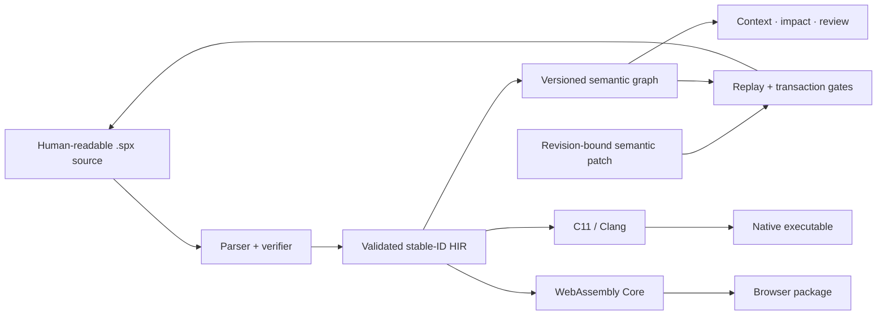

<div align="center">

# SEMAPRAX

### Meaning in. Verified machine code out.

An experimental, agent-native systems programming language built around a
stable semantic program graph.

[](https://github.com/wavect/semaprax/actions/workflows/ci.yml)
[](https://github.com/wavect/semaprax/blob/main/Cargo.toml)
[](#project-status)
[](https://github.com/wavect/semaprax/blob/main/Cargo.toml)
[](LICENSE)

[Get started](#get-started) · [See what works](#project-status) ·
[Read the RFC](docs/RFC-0001.md) · [View the roadmap](docs/ROADMAP.md) ·
[Visit the project page](https://wavect.io/semaprax/)

</div>

> [!WARNING]
> SEMAPRAX is pre-alpha research software. Its language, graph schemas,
> diagnostics, and ABIs will change. Do not use it for production or
> safety-critical workloads.

Most programming tools—and most coding agents—work by editing character
ranges and repeatedly reconstructing program meaning. SEMAPRAX keeps readable
`.spx` source for humans and Git, while exposing a deterministic, versioned
semantic graph as the preferred interface for agents.

That design gives SEMAPRAX three defining properties:

| Principle | What it means |
| --- | --- |
| **Stable meaning** | Public declarations have persistent identities; types, effects, contracts, ownership, and call relationships are explicit. |
| **Verified changes** | Semantic patches are revision-bound, replayable, and stale-safe. Failed transactions leave source unchanged. |
| **Shared lowering** | Native and WebAssembly backends consume the same validated stable-ID HIR and target-neutral cleanup meaning. |

## Get started

### Prerequisites

- [Rust](https://www.rust-lang.org/tools/install) 1.88 or newer
- Clang for native compilation
- Node.js 22 or newer for the browser/WebAssembly verification example

### Clone and run

```sh
git clone https://github.com/wavect/semaprax.git
cd semaprax

# Parse, type-check, and verify a program.
cargo run --locked -p semaprax -- check examples/meaning.spx

# Compile it to a host-native executable and run it.
cargo run --locked -p semaprax -- run examples/meaning.spx
```

The example prints:

```text
42
```

Install the development CLI locally if you prefer shorter commands:

```sh
cargo install --path .
semaprax check examples/meaning.spx
semaprax run examples/meaning.spx
```

### Inspect meaning, not text

```sh
# Emit the deterministic semantic graph.
cargo run --locked -p semaprax -- graph examples/meaning.spx

# Ask for a bounded semantic slice around a stable declaration ID.
cargo run --locked -p semaprax -- context \
  examples/meaning.spx app.main \
  --depth 1 --max-bytes 65536 --max-nodes 256
```

### Build for the web

```sh
cargo run --locked -p semaprax -- build \
  examples/control_flow.spx \
  --target web \
  -o target/control-flow-web

node scripts/verify-web.mjs target/control-flow-web
```

## A small SEMAPRAX program

```semaprax
module examples.meaning;

@id("math.add")
fn add(left: i64, right: i64) -> i64
    requires left >= 0
    requires right >= 0
    ensures result == left + right
{
    left + right
}

@id("app.main")
fn main() -> i64
    ensures result == 42
{
    add(19, 23)
}
```

`@id` gives a public declaration persistent semantic identity. Contracts are
checked and carried into the supported native and Wasm artifact lanes instead
of existing only as comments.

More examples cover [control flow](examples/control_flow.spx),
[effects](examples/effects.spx), [ownership](examples/ownership.spx),
[lifecycles](examples/lifecycle.spx), [records](examples/records.spx), and the
[native callable target](examples/native_callable.spx).

## How it fits together



Readable source is the canonical Git projection. The semantic graph is the
preferred agent projection. Both native and Wasm lowering begin only after the
same parser, resolver, verifier, and HIR validation path.

## Project status

**Current release line:** v0.2 · **Maturity:** pre-alpha research

The [completion matrix](docs/COMPLETION-MATRIX.md) is the source of truth for
project claims. At the current evidence milestone it records **56 Partial** and
**0 Missing** full-goal requirements; the overall product remains Partial
because none of those bounded slices proves the complete gate. A feature is not called implemented
unless its stated gate has executable evidence; a successful narrow prototype
does not satisfy a broader product gate.

### Evidence-backed prototype surface

| Area | Where it is today |
| --- | --- |
| Language core | Typed `i64`/`bool` functions, bindings, expressions, checked arithmetic, contracts, effects, and explicit capabilities. |
| Data model | Bounded records, explicit Copy generics, Copy variants, compiler-owned `Option`/`Result`, exhaustive Copy matching, and a constrained postfix `?` slice. |
| Ownership | Move and partial-place checking, explicit lifecycle/ownership boundaries, and independently replayed target-neutral cleanup plans. General lifetime, aliasing, concurrency, and public resource execution remain open. |
| Agent interface | Deterministic Graph v10–v14, bounded context, impact preview, repair discovery, semantic review, and exact evidence replay. |
| Semantic changes | Atomic single-file patches plus bounded managed multi-file workspace transactions and replacements-only semantic workspace operations. These do not provide general Git/editor-tree atomicity. |
| Project build | A bounded explicit pure-scalar `semaprax.toml` build input reuses one in-memory Workspace Phase-A pass and publishes a Web package or explicit native executable. An unpublished API and strict workspace binary also locally generate the scalar Rust SDK from the authenticated linked Project. Explicit stable-ID `use function` provider edges are its only cross-file composition. This is not dependency management, a managed workspace, or production packaging. |
| Native target | C11/Clang scalar and bounded Copy-data execution plus locally evidenced direct-source and Project-generated scalar Native Rust SDK packages. Exact-head SDK promotion and public general resource/string/FFI/aggregate ABI admission remain open. |
| Web target | WebAssembly Core plus a generated package; selected stable-ID scalar functions have bounded JavaScript/TypeScript bindings. General browser-SDK and public Component Model output remain open. |
| Applications | Private CI evidence exists for bounded desktop and mobile prototypes. Public SDKs, packaging, lifecycle breadth, and production distribution remain open. |
| Agent runtime | A bounded injected-host Rust API has hosted deterministic fake-host evidence. It is not a live provider transport, CLI agent, durable-memory system, wallet, payment, signing, or ambient-authority surface. |

Recently hosted-green gates include public Agent Runtime v1, private and
public Economic Agent v1, and Native Rust Interoperability v1. Exact commits,
run IDs, and boundaries live only in the status headers of
[Agent Runtime v1](docs/AGENT-RUNTIME-V1.md),
[Economic Agent v1](docs/ECONOMIC-AGENT-V1.md), and
[Native Rust Interoperability v1](docs/NATIVE-RUST-INTEROP-V1.md) (with the
[Rust calculator consumer](examples/calculator-rust/README.md)); the
[completion matrix](docs/COMPLETION-MATRIX.md) rolls them up.

For precise evidence, boundaries, and non-claims, use these documents:

- [Full-goal completion matrix](docs/COMPLETION-MATRIX.md) — authoritative status
- [Architecture](docs/ARCHITECTURE.md) — implementation and trust boundaries
- [Quality gates](docs/QUALITY-GATES.md) — required executable evidence
- [Roadmap](docs/ROADMAP.md) — sequencing toward the full objective
- [Changelog](CHANGELOG.md) — notable repository changes

## Agent-native workflow

SEMAPRAX is designed so an agent can ask for the smallest useful semantic
slice, preview a typed change, inspect its consequences, and only then request
an atomic application.

```text
graph/context → semantic patch → impact/review → evidence replay → atomic apply
```

The current public protocols include:

- bounded forward, reverse, or bidirectional call context;
- stable-ID semantic patches with stale-revision rejection;
- read-only impact, diagnostic repair, and fixed-section review projections;
- independently replayable patch and target-evidence capsules;
- bounded immutable-generation workspace publication through an authenticated
  `ACTIVE` pivot for cooperating readers.

Start with [Agent Context v1](docs/AGENT-CONTEXT-V1.md),
[Semantic Impact v1](docs/SEMANTIC-IMPACT-V1.md),
[Semantic Review v1](docs/SEMANTIC-REVIEW-V1.md), and
[Semantic Patch Evidence v1](docs/SEMANTIC-PATCH-EVIDENCE-V1.md).

## CLI at a glance

| Command | Purpose |
| --- | --- |
| `semaprax check <file> [--json]` | Parse, type-check, and verify a source file. |
| `semaprax fmt <file> [--check]` | Apply or verify canonical formatting. |
| `semaprax run <file>` | Build and run a host-native program. |
| `semaprax build <file> [--target native\|native-callable\|web] [--export stable-id ...]` | Produce a native executable, bounded callable bundle, or browser/Wasm package with selected scalar exports. |
| `semaprax check [semaprax.toml]` / `semaprax build [semaprax.toml] [--target web]` | Check or publish the bounded Project Manifest v1 Web package; `--manifest-path` selects another manifest. |
| `semaprax graph <file>` | Emit the revisioned semantic graph. |
| `semaprax context <file> <stable-id> [options]` | Emit a deterministic, bounded semantic context. |
| `semapraxd --stdio [--manifest-path semaprax.toml] [--allow-project-rename\|--allow-project-workflow]` | Serve one authenticated Project snapshot through read-only Transport v2, opt into the bounded v3 rename, or select the v4 derive/preview/impact/review/apply/build workflow. |
| `semaprax impact <file> <patch.spatch> [options]` | Preview supported source consumers and reverse-call impact without writing. |
| `semaprax review <file> <patch.spatch>` | Emit the bounded semantic review report. |
| `semaprax patch <file> <patch.spatch>` | Apply a supported atomic semantic transaction. |

Run `semaprax --help` for the complete workspace, evidence, repair, and target
command surface.

For a calculator-style web core, select persistent function identities directly:

```sh
semaprax build examples/calculator.spx --target web \
  --export calculator.add --export calculator.divide \
  -o calculator-web
```

Import `calculator-web/semaprax.bindings.js` and call
`runtime.call("calculator.add", ...)`. The key survives a source-level
function rename because it is the declaration's persistent identity. See
[Public Wasm Scalar Exports v1](docs/WASM-SCALAR-EXPORTS-V1.md) for the exact
scalar-only boundary and remaining browser/TypeScript gates.

For the bounded multi-file calculator, run `semaprax check
examples/calculator-project/semaprax.toml` or `semaprax build
examples/calculator-project/semaprax.toml --target web -o calculator-project-web`.
The six-line manifest explicitly names all sources, entry/test modules, and Web
exports; it has no dependency or capability syntax. See [Project Manifest
v1](docs/PROJECT-MANIFEST-V1.md) for its scalar-only Web/explicit-native
publication boundary: interface/native imports and `use type` are excluded, while explicit
stable-ID `use function` provider edges compose the named modules. A final
post-publication input drift is `SPX-J103`; callers reconcile the retained
digest-bound package and never delete it automatically.

The committed [browser calculator shell](examples/calculator-web/README.md)
consumes either the direct-source package or this multi-module Project package
without changing its stable-ID calls. The locked Chromium fixture authenticates
the direct package plus exact baseline and display-renamed Project subjects,
their exact six-export inventories, and their generated artifacts. Local
evidence type-checks and serially exercises the same shell against all three.
The cited hosted browser evidence remains the earlier direct-plus-baseline pair.

The unpublished builder workspace binary can generate the exact local Rust SDK
for that authenticated Project through one closed command:

```sh
RUSTC=/absolute/path/to/rustc \
CLANG=/absolute/path/to/clang \
SEMAPRAX_ARCHIVER=/absolute/path/to/the-admitted-platform-archiver \
cargo run --locked --offline -p semaprax-native-rust-interop \
  --bin semaprax-native-rust-sdk -- project \
  --manifest-path "$(pwd)/examples/calculator-project/semaprax.toml" \
  --output "$(pwd)/examples/calculator-rust/generated-project-sdk"
```

The separate compiler-free `project-consumer` exercises all six manifest
exports. Local evidence rebuilds Web/Node and Rust consumers after the daemon
display rename and checks stable-ID behavior across changed authenticated
revisions; exact-head hosted promotion and a root Project-to-Rust CLI remain
pending. The tool paths are required authority, not illustrative defaults; see
[the quality gates](docs/QUALITY-GATES.md) for the exact tested Darwin plan and
the additional Windows tool-root/linker inputs.

For repeated agent queries, `semapraxd --stdio --manifest-path
examples/calculator-project/semaprax.toml` retains that authenticated project's
linked HIR, complete Project graph, and typed context index. Requests bind the
revisions returned by `workspace/open`; input drift invalidates the session
before retained meaning can escape. See [Project Agent Transport
v2](docs/PROJECT-AGENT-TRANSPORT-V2.md). Adding `--allow-project-rename`
selects additive Transport v3 and its sole server-derived
`rename/preview`/`rename/apply` transaction for one explicitly identified Web
export. It is not a general or multi-file edit API; see [Project Rename
Transaction v1](docs/PROJECT-RENAME-TRANSACTION-V1.md). The mutually exclusive
`--allow-project-workflow` selects Transport v4 and adds derive, candidate-bound
Impact/Review, A0 apply, exact reload, and pathless Web rebuild for that bounded
rename slice; see [Project Agent Workflow v1](docs/PROJECT-AGENT-WORKFLOW-V1.md).

## Roadmap

| Stage | Focus |
| --- | --- |
| **0.2 — current** | Useful core language, semantic graph, bounded agent context/change/review, and native/Wasm execution slices. |
| **0.3** | General ownership and lifetime safety, escape analysis, restricted unsafe code, and a fast development backend. |
| **0.4** | Components, packages, reproducible builds, provenance, and portable/native interop. |
| **0.5** | Structured concurrency, deterministic effects, applications, and platform adapters. |
| **1.0** | One maintained product proving the full cross-platform language and toolchain contract. |

This table is orientation, not a claim of completion. See the
[detailed roadmap](docs/ROADMAP.md) and [1.0 completion
contract](docs/COMPLETION-MATRIX.md#final-validation-product).

## Documentation

Every document lives under `docs/`; [`docs/index.md`](docs/index.md) maps them
all and [`docs/SUMMARY.md`](docs/SUMMARY.md) orders them into the published
book (built with mdBook; see `.github/workflows/docs.yml`).

| Document | Read it for |
| --- | --- |
| [RFC 0001](docs/RFC-0001.md) | The language, compiler, interoperability, application, and target contract. |
| [RFC 0002](docs/RFC-0002-ALGEBRAIC-DATA.md) | Algebraic data, records, variants, matching, `Option`, and `Result`. |
| [RFC 0003](docs/RFC-0003-CLEANUP-AND-RESOURCE-ABI.md) | Cleanup, resource ownership, and ABI phases. |
| [RFC 0004](docs/RFC-0004-NATIVE-CALL-SETTLEMENT.md) | Proposed native owned-call recovery and settlement contract. |
| [Architecture](docs/ARCHITECTURE.md) | Compiler stages, backend boundaries, and repository map. |
| [Migrations](docs/MIGRATIONS.md) | Compatibility notes for agent-facing protocols. |

## Contributing

Contributions are welcome. Read [CONTRIBUTING.md](CONTRIBUTING.md) and the
[agent guide](AGENTS.md) before changing semantics. Compiler changes should
include a success case, a stable diagnostic regression, canonical round-trip
coverage, and native/Wasm equivalence when runtime meaning changes.

Run the full Unix quality gate with:

```sh
scripts/quality.sh
```

Design changes affecting syntax, graph schemas, transactions, effects,
ownership, contracts, or ABI should begin as an RFC. By participating, you
agree to follow the [Code of Conduct](CODE_OF_CONDUCT.md).

## Citation and license

Use [CITATION.cff](CITATION.cff) for repository metadata and
[CITATION.md](CITATION.md) for evidence-specific citation guidance. Technical
claims should cite the exact commit and the repository document that supports
them.

SEMAPRAX is created and maintained by Wavect GmbH and distributed under the
[Apache License 2.0](LICENSE).
