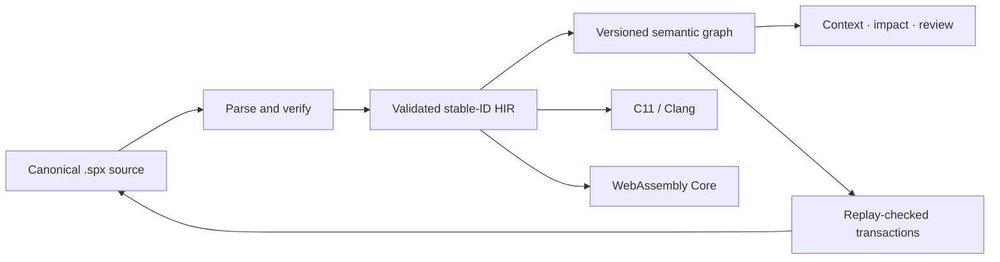

<div align="center">

# SEMAPRAX

### Meaning in. Verified machine code out.

An experimental systems programming language with a stable semantic program
graph designed for humans and software agents.

[](https://github.com/wavect/semaprax/actions/workflows/ci.yml)
[](Cargo.toml)
[](#project-status)
[](Cargo.toml)
[](LICENSE)

[Get started](#get-started) · [Understand the model](#the-programming-model) ·
[Check the status](#project-status) · [Read the docs](docs/index.md)

</div>

> [!WARNING]
> SEMAPRAX is pre-alpha research software. Its language, graph schemas,
> diagnostics, and ABIs can change. Do not use it for production or
> safety-critical workloads.

Most programming tools edit text and reconstruct meaning afterward. SEMAPRAX
keeps readable `.spx` source as the canonical Git representation while
exposing a deterministic, versioned semantic graph for program analysis and
agent operations.

| Principle | Practical effect |
| --- | --- |
| Persistent identity | Public declarations keep stable `@id` values across display-name changes. |
| Checked meaning | Types, effects, contracts, ownership, and call relationships are resolved before lowering. |
| Stale-safe changes | Supported semantic patches bind to a known revision and fail without changing source when replay or validation fails. |
| Shared semantics | Native and WebAssembly lanes start from the same validated HIR and cleanup meaning. |

## Get started

### Requirements

- Rust 1.88 or newer
- Clang for native compilation
- Node.js 22 or newer for the WebAssembly examples

[Install](docs/INSTALL.md) owns the complete routes: which of the two CLIs each
command needs, Cargo `PATH` setup, how to confirm the install, and what a first
failed command means.

### Download v0.2.0

The [v0.2.0 prerelease](https://github.com/wavect/semaprax/releases/tag/v0.2.0)
provides smoke-tested archives for Linux x86-64, Apple Silicon macOS, and
Windows x86-64, plus `SHA256SUMS`. It is still unsigned, not notarized, and
pre-alpha; checksums verify integrity, not publisher identity. The exact
release evidence and archive digests are recorded in the
[release process](docs/RELEASE-PROCESS.md#v020-hosted-release-evidence).

### Check and run a program

```sh
git clone https://github.com/wavect/semaprax.git
cd semaprax

cargo run --locked -p semaprax -- check examples/meaning.spx
cargo run --locked -p semaprax -- run examples/meaning.spx
```

The example prints `42`.

Install the development CLI locally if you prefer shorter commands:

```sh
cargo install --locked --path .
semaprax check examples/meaning.spx
semaprax run examples/meaning.spx
```

Use `semaprax <command> --help` for the exact accepted command shape, or see
the [CLI user guide](docs/CLI-GUIDE.md) for common source, project, formatting,
and automation workflows. `semaprax help language` prints the compiler-checked
[agent quick reference](docs/AGENT-QUICK-REFERENCE.md), the one-page card for
writing `.spx`, without a checkout. Opening a `.spx` file in Visual Studio Code
with the [repository extension](editors/vscode/README.md) loaded gives syntax
highlighting.

Private-host commands require the unpublished full toolchain, not the
standalone crates.io compiler package. Install it from the same checkout to
create a checked calculator project from the built-in template:

```sh
cargo install --locked --path crates/semaprax-toolchain
semaprax-full new first-semaprax
cd first-semaprax
semaprax check semaprax.toml
semaprax test semaprax.toml
```

The generator uses only compiled-in files and does not initialize Git, install
dependencies, or access a network. Continue with the executable
[quickstart](docs/QUICKSTART.md) to run, inspect, and build the project.

To obtain the exact same four calculator files as a replayable stdout document
without granting SEMAPRAX a destination or publication authority:

```sh
semaprax project-scaffold --name first-semaprax
```

The `semaprax.project-scaffold.v1` capsule is caller-materialized data, not an
archive or atomic filesystem publication API.

### Inspect the semantic graph

```sh
semaprax graph examples/meaning.spx
semaprax context examples/meaning.spx app.main \
  --depth 1 --max-bytes 65536 --max-nodes 256
```

### Build a browser package

```sh
semaprax build examples/calculator.spx --target web \
  --export calculator.add --export calculator.subtract \
  --export calculator.multiply --export calculator.divide \
  --export calculator.is-negative --export calculator.not \
  -o target/calculator-web

node scripts/verify-wasm-scalar-exports.mjs target/calculator-web
```

The verifier calls the generated bindings by stable ID and prints
`scalar-exports-v1-ok`. Use `scripts/verify-web.mjs` instead for a package
built from an `app.main` entry, such as `examples/meaning.spx`; it prints that
program's result.

The generated JavaScript API uses stable IDs, so a source-level display rename
does not change the external key. The current boundary is intentionally
limited; see [Wasm Scalar Exports v1](docs/WASM-SCALAR-EXPORTS-V1.md).

### Check a multi-file project

```sh
semaprax check examples/calculator-project/semaprax.toml
semaprax test examples/calculator-project/semaprax.toml
semaprax build examples/calculator-project/semaprax.toml \
  --target web -o target/calculator-project-web
```

The current `semaprax.toml` profile names a closed source set, entry and test
modules, and selected exports. It is a bounded project input, not a dependency
manager or package registry. See [Project Manifest v1](docs/PROJECT-MANIFEST-V1.md)
and its additive versioned extensions for exact limits.

The additive library-only [Offline Multi-Package Source Capsule v1](docs/OFFLINE-MULTI-PACKAGE-SOURCE-CAPSULE-V1.md)
authenticates a narrow caller-owned, effect-free scalar package source closure
above exact offline resolution. [Linked Scalar Core-Wasm Package Build
v2](docs/OFFLINE-LINKED-SCALAR-WASM-PACKAGE-BUILD-V2.md) consumes only that
replayed closure and retained HIR, while the separate safe publisher reuses the
existing exact three-file authority state machine. Both surfaces and their
nonignored hostile evidence ran in the v0.2.0 tag matrix, but they remain
unpromoted; they are not a package manager, target-conformance result,
trusted-provenance system, or hermetic build sandbox.

## A small SEMAPRAX program

```semaprax
module examples.meaning;

@id("math.add")
fn add(left: i64, right: i64) -> i64
    requires left >= 0
    requires right >= 0
    ensures result == left + right
{
    left + right
}

@id("app.main")
fn main() -> i64
    ensures result == 42
{
    add(19, 23)
}
```

`@id` is the declaration's persistent semantic identity. The name `add` is
for humans; tools can continue to refer to `math.add` after a supported rename.

The [language tour](docs/LANGUAGE-TOUR.md) walks from this program to
identity, contracts, records and matching, explicit mutation, ownership,
cleanup, and effects, one runnable example at a time. The
[examples index](examples/README.md) says what every committed example
demonstrates and which command was observed to succeed on it.

## The programming model



Readable source remains the reviewable, version-controlled representation.
The graph is the preferred query and change interface. A graph or evidence
capsule describes meaning; it does not itself grant filesystem, build, or
publication authority.

## CLI overview

| Command | Purpose |
| --- | --- |
| `semaprax --version` / `version --json` | Report deterministic package and injected commit identity. |
| `semaprax-full doctor [--profile <id>] [--target …] [--json]` | Private offline-profile checks; production profiles currently unavailable, with no ambient-tool fallback. |
| `semaprax-full new <destination>` | Private full-toolchain creation and validation of a Project v1 calculator. |
| `semaprax check …` | Parse, resolve, type-check, and verify a file or project manifest. |
| `semaprax fmt <file> [--check]` | Write or check canonical formatting. |
| `semaprax run …` / `semaprax test …` | Execute an admitted file or project through the development path. |
| `semaprax build … --target …` | Produce an admitted native, callable, WebAssembly, Web, or npm artifact. |
| `semaprax graph <file>` | Emit the revisioned semantic graph. |
| `semaprax context <file> <id> …` | Emit bounded semantic context around a declaration. |
| `semaprax impact` / `review` | Preview supported semantic-patch consequences without writing. |
| `semaprax patch` | Apply a supported single-file semantic transaction. |
| `semaprax workspace-*` | Use the bounded managed multi-file protocols. |

`semaprax --help` is a one-screen guided overview of these commands. Run
`semaprax help all` for the complete command list. Many report, evidence,
workspace, and host-integration commands are narrow protocol surfaces intended
for tool authors; their versioned reference documents define the exact
admission rules and non-claims.

The v0.2.0 source tree contains an exact Project v8
`owned-data-api.v1` developer-preview route for `--target npm` and
`--target rust`, plus the `examples/frame-payload-*` validation fixtures. Its
nonignored repository regressions ran in the exact tag workflow, including the
three-host Rust matrices and selected external-consumer jobs. This is hosted
developer-preview evidence, not a registry publication or formal support
decision: generated packages remain unpublished and must not be treated as a
stable or general owned-data ABI. See [Public Owned Data API
v1](docs/PUBLIC-OWNED-DATA-API-V1.md) and the [completion
matrix](docs/COMPLETION-MATRIX.md).

Project v9 flat-owned-record and Project v10 owned-UTF-8 follow-ons also have
exact-tag hosted regression coverage. Their generated packages remain
unpublished, neither profile is promoted, and v10 remains gated on an explicit
v9 promotion decision. See [Public Flat Owned Record API v1](docs/PUBLIC-FLAT-OWNED-RECORD-API-V1.md)
and [Public Owned UTF-8 API v1](docs/PUBLIC-OWNED-UTF8-API-V1.md).

## Project status

**Release:** [v0.2.0 prerelease](https://github.com/wavect/semaprax/releases/tag/v0.2.0) · **Maturity:** pre-alpha research · **Overall goal:**
Partial

SEMAPRAX has executable vertical slices across its language, semantic graph,
agent-change workflow, native C11 lane, Core WebAssembly lane, bounded project
builds, and selected host integrations. It does not yet provide the general
ownership/lifetime system, package ecosystem, stable public ABIs, production
application toolchain, or cross-platform validation required for 1.0.

Status has one owner: the [completion matrix](docs/COMPLETION-MATRIX.md). It
separates the long-term product contract from the current release-exit audit
and links each claim to its evidence-owning specification. Historical changes
belong in the [changelog](CHANGELOG.md); future sequencing belongs in the
[roadmap](docs/ROADMAP.md).

## Documentation

The documentation has three audiences:

- [Public documentation](docs/index.md) explains the language, supported
  workflows, and user-visible boundaries.
- Versioned reference specifications define exact wire formats, admission
  profiles, diagnostics, and compatibility rules for tool and host authors.
- [Development documentation](docs/DEVELOPMENT.md) contains architecture,
  completion evidence, quality gates, roadmap sequencing, migrations, and
  private experiment contracts.

The [book summary](docs/SUMMARY.md) is the exhaustive catalog. Stable
specification paths remain in `docs/` so existing citations keep working.

## Contributing

Read [CONTRIBUTING.md](CONTRIBUTING.md) and [AGENTS.md](AGENTS.md) before
changing semantics. [First contribution](docs/FIRST-CONTRIBUTION.md) sequences
one change end to end against them. On Unix, the complete repository gate is:

```sh
scripts/quality.sh full
```

Changes to syntax, graph schemas, transactions, effects, ownership, contracts,
or ABIs should begin with an RFC or an explicit update to an existing one.

## Citation and license

Use [CITATION.cff](CITATION.cff) for repository metadata and
[CITATION.md](CITATION.md) for claim-specific evidence guidance. SEMAPRAX is
maintained by Wavect GmbH and distributed under the
[Apache License 2.0](LICENSE).
