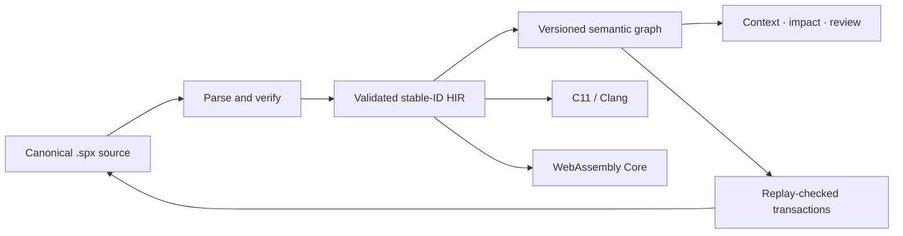

<div align="center">

# SEMAPRAX

### Meaning in. Verified machine code out.

An experimental systems programming language with a stable semantic program
graph designed for humans and software agents.

[](https://github.com/wavect/semaprax/actions/workflows/ci.yml)
[](Cargo.toml)
[](#project-status)
[](Cargo.toml)
[](LICENSE)

[Get started](#get-started) · [Understand the model](#the-programming-model) ·
[Check the status](#project-status) · [Read the docs](docs/index.md)

</div>

> [!WARNING]
> SEMAPRAX is pre-alpha research software. Its language, graph schemas,
> diagnostics, and ABIs can change. Do not use it for production or
> safety-critical workloads.

Most programming tools edit text and reconstruct meaning afterward. SEMAPRAX
keeps readable `.spx` source as the canonical Git representation while
exposing a deterministic, versioned semantic graph for program analysis and
agent operations.

| Principle | Practical effect |
| --- | --- |
| Persistent identity | Public declarations keep stable `@id` values across display-name changes. |
| Checked meaning | Types, effects, contracts, ownership, and call relationships are resolved before lowering. |
| Stale-safe changes | Supported semantic patches bind to a known revision and fail without changing source when replay or validation fails. |
| Shared semantics | Native and WebAssembly lanes start from the same validated HIR and cleanup meaning. |

## Get started

### 1. Check prerequisites (10s)

| Need | Version | Check | Why you need it |
| --- | --- | --- | --- |
| Rust (`cargo`, `rustc`) | 1.88+ | `rustc --version` | Builds and installs the CLIs |
| Clang | any C11 driver | `clang --version` | Native lane (`--target native`) emits C11 and spawns `clang` |
| Node.js | 22+ | `node --version` | Verifies Wasm/Web packages; not needed for `check`/`run` |
| Git | any recent | `git --version` | Only to clone the checkout |

```sh
rustc --version  # ≥1.88
clang --version
node --version   # ≥22 for `build --target web` verification
```

Missing one? `rustup` for Rust, `xcode-select --install` / `apt install clang` / `nvm install 22`. Full prerequisites, `PATH` setup, and what a first failure means live in [Install](docs/INSTALL.md).

### 2. Try without installing (30s) — recommended

```sh
git clone https://github.com/wavect/semaprax.git
cd semaprax
cargo run --locked -p semaprax -- check examples/meaning.spx  # → verified examples/meaning.spx
cargo run --locked -p semaprax -- run examples/meaning.spx    # → 42
```

No `cargo install`, no `PATH` edits. This is what the docs and CI use to be unambiguous. Use `semaprax --help` or `semaprax help language` (compiler-checked [agent quick reference](docs/AGENT-QUICK-REFERENCE.md)) for the one-page card without a checkout. Open a `.spx` file in VS Code with the [repository extension](editors/vscode/README.md) for syntax highlighting.

### 3. Install for short commands (optional, 60s)

```sh
cargo install --locked --path .          # installs `semaprax`
# for private host surfaces, from the same checkout:
cargo install --locked --path crates/semaprax-toolchain  # installs `semaprax-full`
```

If `command not found`, add Cargo's bin dir to `PATH` (details in [Install](docs/INSTALL.md#put-cargos-binary-directory-on-your-path)):

```sh
export PATH="$HOME/.cargo/bin:$PATH"   # bash/zsh, new shell afterwards
command -v semaprax
semaprax check examples/meaning.spx
semaprax run examples/meaning.spx
```

Prefer a pre-built binary (no Rust needed)? Download the [v0.4.0 prerelease](https://github.com/wavect/semaprax/releases/tag/v0.4.0) archive for your host and put the unpacked `semaprax` on `PATH`.

### 4. Create your first project (30s)

```sh
semaprax new first-semaprax
cd first-semaprax
semaprax check .   # parse + type-check the generated `semaprax.toml` project
semaprax test .    # run the project's test
semaprax run .     # → 42
```

`new` uses only compiled-in files, writes to a fresh directory under an existing parent, never replaces an entry, and touches no network/Git. Every generated project carries an `AGENTS.md` with the commands and the rules that differ from other languages. Re-run `semaprax help diagnostic SPX-T208` for one indexed correction, or `semaprax help diagnostic codes` for the full inventory.

Need the same five files as a reproducible stdout doc without granting a destination? `semaprax project-scaffold --name first-semaprax` prints the `semaprax.project-scaffold.v2` capsule (caller-materialized data, not a publication API).

Full walkthrough: [quickstart](docs/QUICKSTART.md).

### 5. What you can do next (copy-paste)

```sh
# bounded semantic view
semaprax graph examples/meaning.spx
semaprax context examples/meaning.spx app.main --depth 1 --max-bytes 65536 --max-nodes 256
```

Build a browser package from the library calculator (pinned walkthrough — prints `scalar-exports-v1-ok`):

```sh
semaprax build examples/calculator.spx --target web \
  --export calculator.add --export calculator.subtract \
  --export calculator.multiply --export calculator.divide \
  --export calculator.is-negative --export calculator.not \
  -o target/calculator-web

node scripts/verify-wasm-scalar-exports.mjs target/calculator-web
```

```sh
# multi-file project (check / test / build)
semaprax check examples/calculator-project/semaprax.toml
semaprax test examples/calculator-project/semaprax.toml
semaprax build examples/calculator-project/semaprax.toml --target web -o target/calculator-project-web
```

The generated JS API uses stable IDs — a display rename does not change the external key; see [Wasm Scalar Exports v1](docs/WASM-SCALAR-EXPORTS-V1.md). The extensible `semaprax.manifest.v1` can also name exact local `Subject-v3` closures and Cargo crate inputs for the Native Rust SDK (no allowlist; `import rust fn` keeps the Rust API outside checked code). Details in [Project Dependencies v1](docs/PROJECT-DEPENDENCIES-V1.md) and [Project Manifest v1](docs/PROJECT-MANIFEST-V1.md).

> Offline packages: the additive [Offline Multi-Package Source Capsule v1](docs/OFFLINE-MULTI-PACKAGE-SOURCE-CAPSULE-V1.md) + [Linked Scalar Core-Wasm Package Build v2](docs/OFFLINE-LINKED-SCALAR-WASM-PACKAGE-BUILD-V2.md) authenticate a narrow caller-owned scalar closure above offline resolution. Their nonignored hostile evidence ran in the tagged matrix, unpromoted — not a package manager, trusted provenance, or hermetic sandbox.

### Releases and changelog

The published tag is the
[v0.4.0 prerelease](https://github.com/wavect/semaprax/releases/tag/v0.4.0)
(2026-09-10, `dfc15e2d`) with smoke-tested archives, SHA256 checksums, and
hosted release evidence in the
[release process](docs/RELEASE-PROCESS.md#040-hosted-release-evidence); the
prior `v0.2.0` remains archived at
[its release record](docs/RELEASE-PROCESS.md#v020-hosted-release-evidence).
The
development changelog is now summarized in [CHANGELOG.md](CHANGELOG.md),
with compact highlights in [docs/CHANGELOG-SUMMARY.md](docs/CHANGELOG-SUMMARY.md)
and full historical detail archived at
[docs/CHANGELOG-ARCHIVE.md](docs/CHANGELOG-ARCHIVE.md).

## A small SEMAPRAX program

```semaprax
module examples.meaning;

@id("math.add")
fn add(left: i64, right: i64) -> i64
    requires left >= 0
    requires right >= 0
    ensures result == left + right
{
    left + right
}

@id("app.main")
fn main() -> i64
    ensures result == 42
{
    add(19, 23)
}
```

`@id` is the declaration's persistent semantic identity. The name `add` is
for humans; tools can continue to refer to `math.add` after a supported rename.

The [language tour](docs/LANGUAGE-TOUR.md) walks from this program to
identity, contracts, records and matching, explicit mutation, ownership,
cleanup, and effects, one runnable example at a time. The
[examples index](examples/README.md) says what every committed example
demonstrates and which command was observed to succeed on it.

Coding agents and readers with a small context window can start from the
compiler-checked [agent quick reference](docs/AGENT-QUICK-REFERENCE.md)
instead: one page of admitted shapes, the diagnostics that habits from other
languages trigger, and the fix for each. The generated
[standard library catalog](docs/STANDARD-LIBRARY-CATALOG.md) lists every
`std.*` declaration that exists today with its contract. An installed compiler
can return one exact entry without transferring the whole catalog:
`semaprax help library <module|name|stable-id>`. It can likewise return one
compiler-verified declaration example with
`semaprax help shapes <kind|stable-id|path#stable-id>`, or one compiler-checked
language-card section with `semaprax help language <topic>` after listing the
stable selectors with `semaprax help language topics`.
Given a diagnostic such as `SPX-T208`, the installed compiler can instead
return only its common failed form and correction with `semaprax help
diagnostic SPX-T208`; `semaprax help diagnostic codes` lists the closed exact
inventory.

## The programming model



Readable source remains the reviewable, version-controlled representation.
The graph is the preferred query and change interface. A graph or evidence
capsule describes meaning; it does not itself grant filesystem, build, or
publication authority.

## CLI overview

| Command | Purpose |
| --- | --- |
| `semaprax --version` / `version --json` | Report deterministic package and injected commit identity. |
| `semaprax-full doctor [--profile <id>] [--target …] [--json]` | Private offline-profile checks; production profiles currently unavailable, with no ambient-tool fallback. |
| `semaprax new <destination>` | Create and verify a Project v1 calculator from the built-in template; the full toolchain publishes the same files through a staged rename. |
| `semaprax check …` | Parse, resolve, type-check, and verify a file or project manifest. |
| `semaprax fmt <file> [--check]` | Write or check canonical formatting. |
| `semaprax run …` / `semaprax test …` | Execute an admitted file or project through the development path. |
| `semaprax build … --target …` | Produce an admitted native, callable, WebAssembly, Web, or npm artifact. |
| `semaprax graph <file>` | Emit the revisioned semantic graph. |
| `semaprax context <file|project> <id> …` | Emit bounded semantic context around a declaration. |
| `semaprax query <file|project> …` | Find declarations and semantic callers without reading the full graph. |
| `semaprax impact` / `review` | Preview supported semantic-patch consequences without writing. |
| `semaprax patch` | Apply a supported single-file semantic transaction. |
| `semaprax workspace-*` | Use the bounded managed multi-file protocols. |

`semaprax --help` is a one-screen guided overview of these commands. Run
`semaprax help all` for the complete command list. Many report, evidence,
workspace, and host-integration commands are narrow protocol surfaces intended
for tool authors; their versioned reference documents define the exact
admission rules and non-claims.

This source tree contains a Project v8
`owned-data-api.v1` developer-preview route for `--target npm` and
`--target rust`, plus the `examples/frame-payload-*` validation fixtures. Its
nonignored repository regressions include exact-tag evidence, including the
three-host Rust matrices and selected external-consumer jobs. This is hosted
developer-preview evidence, not a registry publication or formal support
decision: generated packages remain unpublished and must not be treated as a
stable or general owned-data ABI. See [Public Owned Data API
v1](docs/PUBLIC-OWNED-DATA-API-V1.md) and the [completion
matrix](docs/COMPLETION-MATRIX.md).

Project v9 flat-owned-record and Project v10 owned-UTF-8 follow-ons also have
exact-tag hosted regression coverage. Their generated packages remain
unpublished, neither profile is promoted, and v10 remains gated on an explicit
v9 promotion decision. See [Public Flat Owned Record API v1](docs/PUBLIC-FLAT-OWNED-RECORD-API-V1.md)
and [Public Owned UTF-8 API v1](docs/PUBLIC-OWNED-UTF8-API-V1.md).

## Project status

**Release:** [v0.4.0 prerelease](https://github.com/wavect/semaprax/releases/tag/v0.4.0) · **Changelog:** [CHANGELOG.md](CHANGELOG.md) · **Maturity:** pre-alpha research · **Overall goal:**
Partial

SEMAPRAX has executable vertical slices across its language, semantic graph,
agent-change workflow, native C11 lane, Core WebAssembly lane, bounded project
builds, and selected host integrations. It does not yet provide the general
ownership/lifetime system, package ecosystem, stable public ABIs, production
application toolchain, or cross-platform validation required for 1.0.

Status has one owner: the [completion matrix](docs/COMPLETION-MATRIX.md). It
separates the long-term product contract from the current release-exit audit
and links each claim to its evidence-owning specification. Historical changes
belong in the [changelog](CHANGELOG.md); future sequencing belongs in the
[roadmap](docs/ROADMAP.md).

## Documentation

The documentation has three audiences:

- [Public documentation](docs/index.md) explains the language, supported
  workflows, and user-visible boundaries.
- Versioned reference specifications define exact wire formats, admission
  profiles, diagnostics, and compatibility rules for tool and host authors.
- [Development documentation](docs/DEVELOPMENT.md) contains architecture,
  completion evidence, quality gates, roadmap sequencing, migrations, and
  private experiment contracts.

The [book summary](docs/SUMMARY.md) is the exhaustive catalog. Stable
specification paths remain in `docs/` so existing citations keep working.

## Contributing

Read [CONTRIBUTING.md](CONTRIBUTING.md) and [AGENTS.md](AGENTS.md) before
changing semantics. [First contribution](docs/FIRST-CONTRIBUTION.md) sequences
one change end to end against them. On Unix, the complete repository gate is:

```sh
scripts/quality.sh full
```

Changes to syntax, graph schemas, transactions, effects, ownership, contracts,
or ABIs should begin with an RFC or an explicit update to an existing one.

## Citation and license

Use [CITATION.cff](CITATION.cff) for repository metadata and
[CITATION.md](CITATION.md) for claim-specific evidence guidance. SEMAPRAX is
maintained by Wavect GmbH and distributed under the
[Apache License 2.0](LICENSE).
