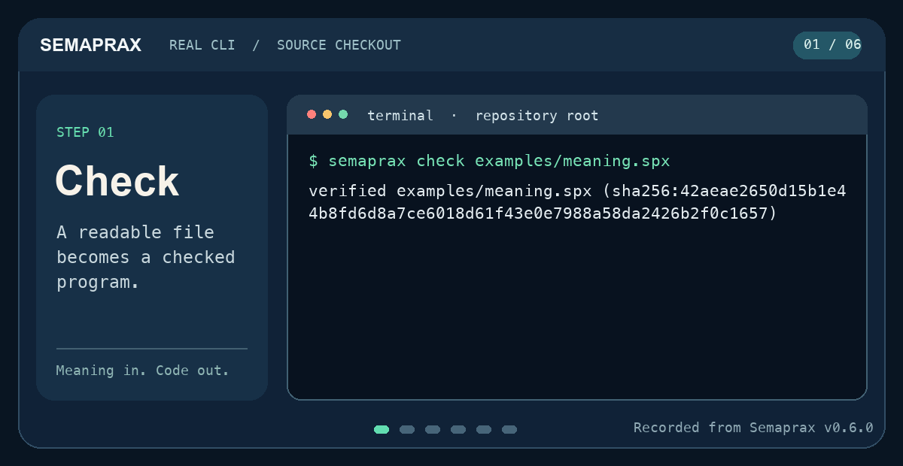

# The Semaprax Handbook


**Meet Ernesto, Semaprax's official mascot.** He'll accompany your first steps
from a small `.spx` file to a checked project. You can follow the whole path at
your own pace.

> This edition follows `main`. The workspace version is
> **0.8.0**. The **v0.7.0 prerelease** was published on October 1, 2026;
> the current source includes later changes. Use the
> [installation guide](getting-started/install.md) to choose your build.
> Semaprax is **research software**: syntax, protocols, and binary
> interfaces can change. Experiment and prototype; don't ship production or
> safety-critical workloads on it yet.

[](getting-started/see-it-in-action.md)

[Watch the steps and read the commands](getting-started/see-it-in-action.md).
The animation shows output from a source-built Semaprax CLI; the linked page
includes a still image and a text transcript.

## Semaprax in 60 seconds

Semaprax is a systems programming language designed so **humans and AI agents
can work on the same program**. You write readable `.spx` source files. The
compiler checks them and exposes a **semantic graph**: declarations, types,
contracts, effects, and who-calls-whom — queryable by stable identity instead
of by guessing from text.

Five ideas explain the whole language:

| Idea | What it means in practice |
| --- | --- |
| **Readable source in Git** | `.spx` files are the canonical artifact. One formatter, one canonical layout, no style debates. |
| **Stable identities** | Every declaration gets an `@id("math.add")` that survives renames, so tools and agents can track it across edits. |
| **Contracts and effects** | Functions state what they require, what they promise (`requires`/`ensures`), and which effects they use (`uses`). The compiler checks all three. |
| **Ownership** | Values are owned or borrowed. The compiler rejects use-after-move and data races at compile time instead of crashing at runtime. |
| **One meaning, three engines** | Checked code runs identically on the interpreter, native (C11), and WebAssembly backends. |

A program is verified before it ever runs: `check` proves it, `run` executes
`main`, `test` runs its test module, `build` targets native or web.

## Build your understanding one working program at a time

You only need basic experience with variables and functions to start. The
first lessons explain each new term before using it. You will run a file,
split code into modules, add tests, and build a package another application
can call.

Start with [First program](getting-started/first-program.md) after installing.
Keep the [glossary](reference/glossary.md) nearby for words such as *borrow*,
*profile*, and *semantic graph*. Each later chapter begins with a practical
reason to use the feature.

| What you want to do | Read next |
| --- | --- |
| Install and return your first result | [Install](getting-started/install.md) → [First program](getting-started/first-program.md) |
| See the tools before trying them | [Recorded walkthrough](getting-started/see-it-in-action.md) |
| Create a project and understand its files | [First project](getting-started/first-project.md) → [Modules and imports](projects/modules.md) |
| Learn the language | [Essentials](language/essentials.md) → [Types](language/types.md) → [Ownership](language/ownership.md) |
| Work with collections and reusable functions | [Functions](language/functions.md) · [Loops](language/loops.md) · [Collections](language/collections.md) |
| Model behavior and external operations | [Classes](language/classes.md) · [Matching](language/matching.md) · [Contracts and effects](language/contracts-effects.md) · [I/O](language/io.md) · [Resources](language/resources.md) |
| Use project data and choose a target | [Manifests](projects/manifests.md) → [Profiles](projects/profiles.md) → [Targets](projects/targets.md) |
| Reuse code in an existing application | [Rust and other integrations](projects/integrations.md) |
| Write and inspect laws | [Laws and proofs](language/laws.md) |
| Build an agent with typed decisions | [Agent programs](agents/programs.md) → [Recovery and budgets](agents/recovery.md) |
| Work in VS Code | [Editor setup](getting-started/editor.md) |
| Let a coding agent inspect and change code | [Agent workflow](practices/agents.md) → [Semantic explorer](practices/explorer.md) |
| Measure context size and reuse checked work | [Token reports and caches](practices/context-performance.md) |
| Test, debug, and prepare a release | [Testing](practices/testing.md) · [Debugging](practices/debugging.md) · [Shipping](projects/shipping.md) |
| Look something up | [Cheatsheet](reference/cheatsheet.md) · [Standard library](reference/stdlib.md) · [Built-ins](reference/builtins.md) · [Cookbook](practices/cookbook.md) |

The handbook teaches everyday use. For implementation details, use the
[source map](reference/source-map.md) and the linked specifications. They
connect each workflow to the code that implements it.

## The 2-minute tour

One file, one module, one `main` returning `i64`:

```semaprax
module examples.meaning;

@id("math.add")
fn add(left: i64, right: i64) -> i64
    requires left >= 0
    requires right >= 0
    ensures result == left + right
{
    left + right
}

@id("app.main")
fn main() -> i64
    ensures result == 42
{
    add(19, 23)
}
```

```sh
semaprax check examples/meaning.spx   # verify: types, contracts, effects, ownership
semaprax run examples/meaning.spx     # prints 42
```

That's the first loop: write it, `fmt` it, `check` it, `run` it. From here,
[write your first program](getting-started/first-program.md) or
[inspect what the compiler knows](getting-started/see-it-in-action.md).
