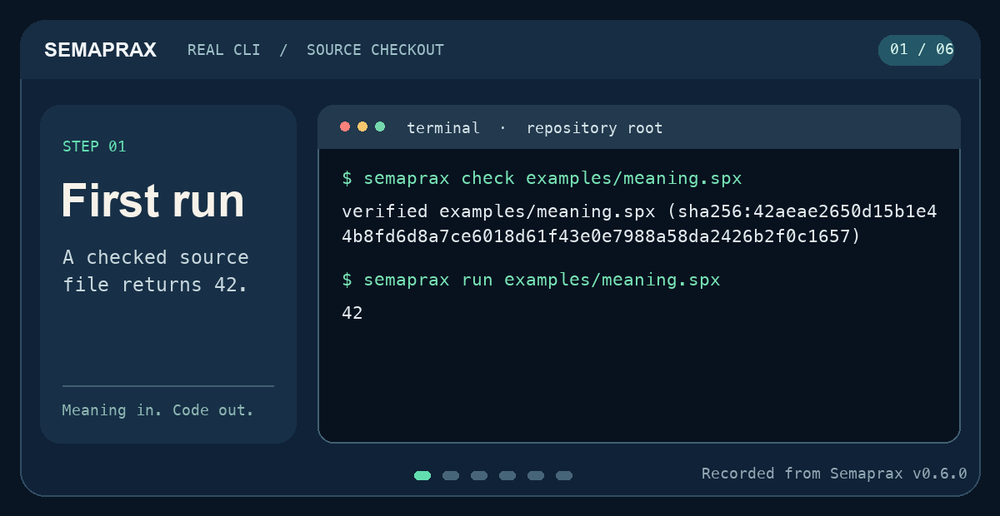

# See Semaprax in action

Six commands move from a readable source file to a tested project and its
WebAssembly package. Ernesto is along for the ride. The recorded results came
from the source-built Semaprax v0.6.0 CLI and Node.js on committed examples.


The animation renders [recorded command output](../assets/demo/transcript.txt).
It loops; the commands below let you move at your own pace.

## 1. Check a program, then run it

The committed [`examples/meaning.spx`](https://github.com/wavect/semaprax/blob/main/examples/meaning.spx)
defines `math.add`, calls it with `19` and `23`, and returns the result from
`app.main`.

```sh
semaprax check examples/meaning.spx
semaprax run examples/meaning.spx
```

The check reports a source revision; the run prints `42`.



The `@id("math.add")` in the source is a persistent declaration identity.
The displayed function name is `add`; the next command shows both.

## 2. Ask what the compiler knows

```sh
semaprax query examples/meaning.spx
```

```text
function    math.add    fn add(left: i64, right: i64) -> i64
function    app.main    fn main() -> i64
```

`query` lists the declarations in a small, readable result. For a summary of
their contracts, try `semaprax doc examples/meaning.spx`. For one declaration's
neighborhood, use `semaprax context examples/meaning.spx math.add --depth 1`.
The [agent workflow guide](../practices/agents.md) explains when to choose each
view.

## 3. Test a project and build for the web

The [calculator project](https://github.com/wavect/semaprax/tree/main/examples/calculator-project)
uses multiple `.spx` files and a `semaprax.toml` manifest.

```sh
semaprax test examples/calculator-project/semaprax.toml
semaprax build examples/calculator-project/semaprax.toml \
  --target web -o target/handbook-demo-web
node scripts/verify-wasm-scalar-exports.mjs target/handbook-demo-web
```

The recorded results are `project tests passed`, `built project web package
target/handbook-demo-web`, and `scalar-exports-v1-ok`. The package contains
`app.wasm`, JavaScript bindings, TypeScript declarations, and an export
descriptor. The build needs a fresh output path; if you repeat it, choose a
new directory.

With Node.js 22+, you can call an exported function by its stable identity:

```sh
node --input-type=module <<'JS'
import { readFile } from 'node:fs/promises';
import { instantiateBytes } from './target/handbook-demo-web/semaprax.bindings.js';

const runtime = await instantiateBytes(
  await readFile('target/handbook-demo-web/app.wasm')
);
console.log(runtime.call('calculator.add', 19n, 23n));
JS
```

```text
{ ok: true, value: 42n }
```

The `n` marks JavaScript `BigInt` values at this `i64` boundary. The result
is structured, so callers can also handle a reported failure.

## Make your own first step

Run the commands above from the repository root after following
[Install](install.md). Then create a file with [First program](first-program.md)
or scaffold a multi-file app with [First project](first-project.md). When you
want to choose a target, continue to [Targets](../projects/targets.md).
